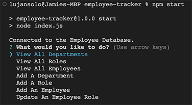
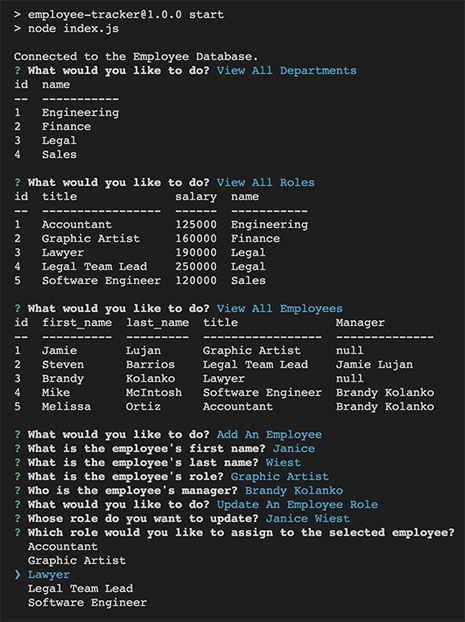

# EMPLOYEE TRACKER (c/o Big Brother)

## Quick Links

[LujanSolo's Github Repo for EmpTracker](https://github.com/LujanSolo/employee-tracker)

[VIDEO LINK walk-thru of Application](https://drive.google.com/file/d/1bQKBUkhNyI-GKHSJGebdCy2vGvmMTPTj/view)

## Description

The Employee Tracker is a content management system (CMS) that allows the user to easily view their employee database, create new entries as needed, and update existing entries. The interface has been built with Inquirer and SQL, allowing everyday users a simple way to interact with the back-end database.

## Table of Contents

- [Installation](#installation)
- [Usage](#usage)
- [Screenshots](#screenshots)
- [GIF](#gif)
- [License](#license)
- [Questions](#questions)

## Installation

Download the zip folder or clone the repository for the application, which can be found [HERE](https://github.com/LujanSolo/employee-tracker) - and install them to a directory/folder of your choice on your computer.

## Usage

In your CLI (command line interface, e.g. Terminal on a Mac, gitBash on Windows), open the directory where you installed the repository's files. Be sure to have Node and mySQL installed by typing `npm i` in your CLI, press `ENTER`, then type `npm i mysql2` and press `ENTER`.

Run the application by typing `npm start` in your CLI. Use your arrow keys to cycle through the options that are presented on the screen; hitting `ENTER` on any option will present a new list of prompts for you to follow and answer.

## Screenshots

### CLI at application launch:

### Another look with multiple options selected:

## GIF

NA

## License

This project is covered under the [MIT License](https://opensource.org/licenses/MIT).

## Questions

GitHub profile: https://github.com/LujanSolo

Contact me at lujansolo@proton.me for additional inquiries.
